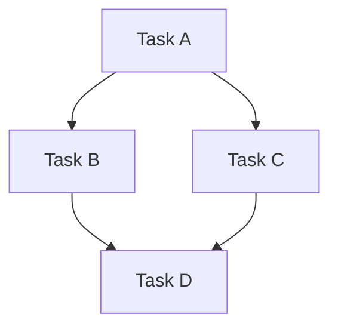

> Managed by workflow: `10_execution_scaffold_v1` / step: `generate_templates`
> This file is workflow-generated and protected from manual edits.

# Delivery Task Graph Template

> Artifact key: `DELIVERY_TASK_GRAPH_TEMPLATE`

## Metadata

| Field | Value |
|---|---|
| Template ID | `DELIVERY-TG-v1` |
| Owner Workflow | `10_execution_scaffold_v1` |
| Owner Step | `generate_templates` |
| Scope | Universal baseline — applies to all governed repositories |
| Status | `active` |
| Last Verified | 2026-07-04 |

This template defines the canonical structure for a delivery task graph. Every task graph artifact must conform to this structure.

---

## Instance Preamble

```yaml
---
title: Task Graph — {GRAPH_ID}
managed_by: workflow-generated
workflow: 10_execution_scaffold_v1
step: task_execution_v1
created: {DATE}
template_id: DELIVERY-TG-v1
graph_id: {GRAPH_ID}
plan_id: {PLAN_ID}
initiative_id: {INITIATIVE_ID}
status: draft
current_profile: {CURRENT_PROFILE}
target_profile: {TARGET_PROFILE}
migration_mode: {MIGRATION_MODE}
---
```

## Metadata

| Field | Value |
|---|---|
| Graph ID | `{GRAPH_ID}` |
| Plan ID | `{PLAN_ID}` |
| Initiative ID | `{INITIATIVE_ID}` |
| Created | `{DATE}` |
| Author / Agent | Task Decomposer |
| Status | `draft` / `approved` / `rejected` |
| Current Architecture Profile | `{CURRENT_PROFILE}` |
| Target Architecture Profile | `{TARGET_PROFILE}` |
| Migration Mode | `{MIGRATION_MODE}` |

## Task Graph Objective

| Field | Value |
|---|---|
| Objective | `{OBJECTIVE}` |
| Derived From | `{PLAN_ID}` |
| Total Tasks | `{COUNT}` |
| Documentation Tasks | `{COUNT}` |
| Code Tasks | `{COUNT}` |

## Task Graph

### Task Nodes

| Task ID | Title | Type | Documentation Required | Estimated Effort | Status |
|---|---|---|---|---|---|
| `{TASK_ID}` | `{TITLE}` | `code` / `doc` / `config` / `validation` | `yes` / `no` | `{EFFORT}` | `pending` |

### Dependency Edges

| From Task | To Task | Edge Type | Notes |
|---|---|---|---|
| `{TASK_ID_A}` | `{TASK_ID_B}` | `blocks` / `advisory` / `parallel` | `{NOTES}` |

### Graph Visualization (Mermaid)



## Execution Flow

| Phase | Tasks | Parallelism | Gate |
|---|---|---|---|
| Phase 1 | `{TASK_IDS}` | `sequential` / `parallel` | `{GATE_CRITERIA}` |
| Phase 2 | `{TASK_IDS}` | `sequential` / `parallel` | `{GATE_CRITERIA}` |

## Documentation Workstream

This section ensures documentation coverage is preserved as a first-class workstream.

| Workstream ID | Description | Tasks Covered | Verification |
|---|---|---|---|
| `DOC-WS-001` | Baseline doc freshness for touched modules | `{TASK_IDS}` | `validate_codebase_docs` |
| `DOC-WS-002` | Change-impact record creation | `{TASK_IDS}` | Manual review |
| `DOC-WS-003` | Profile-specific doc obligations (if applicable) | `{TASK_IDS}` | `{METHOD}` |

**Rule:** Every task graph MUST include at least one documentation workstream entry for baseline obligations. Additional workstreams are added when the plan identifies profile-specific documentation obligations.

## Success Criteria

| # | Criterion | Measurement |
|---|---|---|
| 1 | {CRITERION} | {MEASUREMENT} |
| 2 | All tasks have defined documentation obligations | Task template compliance check |
| 3 | Documentation workstream coverage is non-empty | Workstream table has ≥ 1 entry |

## Cross-References

| Reference | Location |
|---|---|
| Source Plan | `{PLAN_PATH}` |
| Source Initiative | `{INITIATIVE_PATH}` |
| Delivery SOP | `docs/system/00_governance/bootstrap/WORKFLOW_SOP_v1.md` |
| Delivery Status Rules | `docs/system/00_governance/bootstrap/DELIVERY_STATUS_RULES_v1.md` |

## Notes

- {NOTE_1}
- {NOTE_2}
